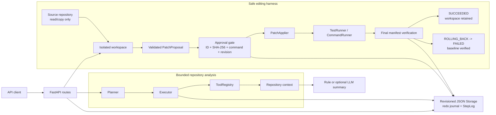
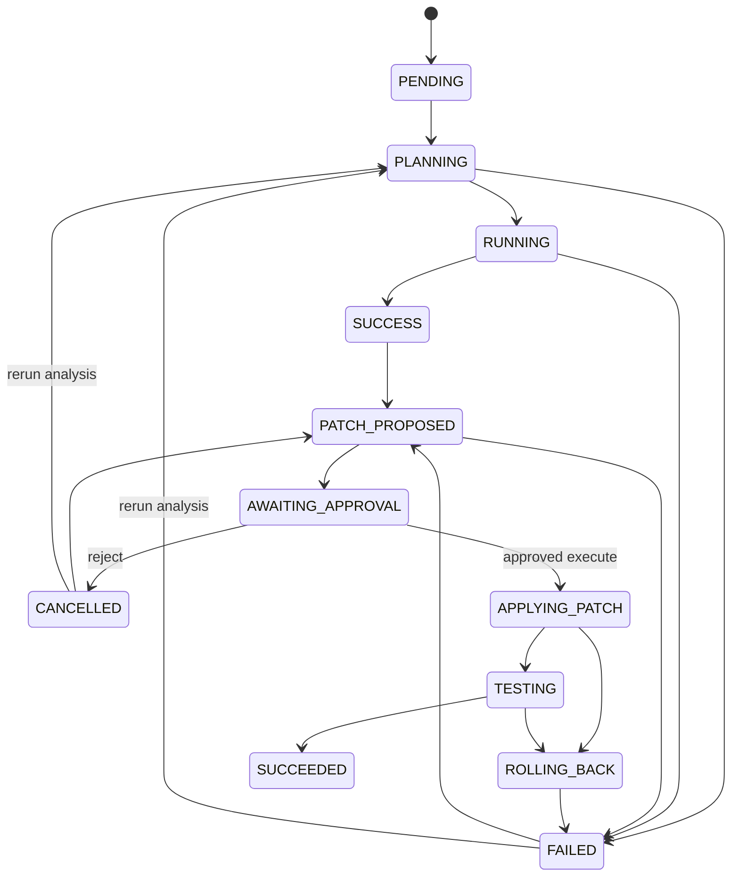

# OpenCode-Lite

[](https://github.com/liz312948-crypto/opencode-lite/actions/workflows/ci.yml)

OpenCode-Lite is a safe, inspectable, test-driven coding-agent harness that turns a
reviewed unified diff into a verified workspace-only edit or a verified rollback.

It accepts a local repository and a question, builds repository context and a
modification plan, then supports a human-reviewed patch workflow inside an isolated
workspace. Every state change, tool call, test result, and rollback outcome is
inspectable through the API.

> **Independent project disclaimer:** OpenCode-Lite is an independent educational and
> engineering project. It is not affiliated with or endorsed by the OpenCode project.
>
> **独立项目免责声明：** OpenCode-Lite 是一个独立的学习与工程项目，不隶属于
> OpenCode 项目，也未获得其认可或背书。

Current version: [**v0.3.0-alpha**](https://github.com/liz312948-crypto/opencode-lite/releases/tag/v0.3.0-alpha)
(`0.3.0a1` in Python package metadata).

## Why This Project

AI coding tools need more than an LLM response. A useful backend must create a task,
collect bounded repository context, propose an exact change, pause for review, execute
only approved work, run tests, preserve evidence, and recover from failure.

OpenCode-Lite implements that backend control path in a small FastAPI project:

```text
repository understanding -> modification planning -> isolated workspace
-> patch proposal -> diff review -> explicit approval -> patch apply
-> bounded tests -> success or verified rollback -> execution report
```

It is not a full IDE and does not try to replace Cursor, Trae, Copilot, or OpenCode.
Those are end-user coding products or environments; OpenCode-Lite is a focused backend
harness for learning, interviewing, and experimenting with safe repository-level task
execution.

| Area | Full coding products | OpenCode-Lite |
| --- | --- | --- |
| User experience | Editor, chat, terminal, or integrated workflow | REST API and OpenAPI only |
| Code changes | Product-specific interactive editing | Approved unified diff in an isolated copy |
| Execution | Rich product/runtime integration | One allowlisted, bounded test command |
| Scope | Broad coding assistance | Repository understanding and safe editing control flow |
| Goal | Daily developer productivity | Inspectable backend architecture prototype |

## Current Capabilities

- Repository understanding through file listing, README reading, and keyword search.
- Structured `modification_plan`, `risk_notes`, `suggestions`, and key-file output.
- Existing Planner, Executor, ToolRegistry, JSON Storage, and bounded search retry.
- Optional OpenAI-compatible repository summarizer with deterministic rule fallback.
- Explicit task state machine with validated transitions and transition logs.
- Per-task temporary workspace; harness-managed patch, reset, and cleanup writes never
  target the submitted source repository.
- Text unified-diff validation, dry run, path containment, and exact diff preview.
- Human approval bound to both `patch_id` and a SHA-256 content hash.
- `shell=False` command execution with argv, workspace cwd, timeout, streaming output
  limits, minimal environment inheritance, and bounded process-tree cleanup.
- Allowlisted `pytest`, `python -m pytest`, and `npm test` command shapes.
- Success reports with retained workspace and actual diff.
- Failure and timeout reports with baseline/final manifest hashes, source-integrity
  evidence, and rollback verification.

## Product Boundary

OpenCode-Lite currently does **not** provide:

- A GUI, TUI, IDE extension, or complete OpenCode implementation.
- Automatic changes to the user's source repository.
- Automatic patch generation in rule-fallback mode.
- Arbitrary shell commands, LLM-selected commands, or unbounded retries.
- File creation/deletion, renames, binary patches, or advanced Git patch forms.
- Docker/VM sandboxing or operating-system process isolation.
- Multi-agent orchestration, MCP, RAG, vector search, LSP, or AST indexing.
- Automatic merge, push, pull request creation, or cloud deployment.
- Production-grade multi-process storage or tenancy.

Successful edits remain only in the task workspace. There is intentionally no
`apply-to-source` endpoint in v0.3.0-alpha.

## 5-Minute Quick Start

The demos use only `tests/fixtures/sample_repo`; they do not edit a real user
repository. Keep the API bound to loopback and use one Uvicorn worker.

### Windows

```powershell
git clone https://github.com/liz312948-crypto/opencode-lite.git
Set-Location opencode-lite
py -3.12 -m venv .venv
.\.venv\Scripts\Activate.ps1
python -m pip install -e ".[dev]"
Remove-Item Env:OPENAI_API_KEY -ErrorAction SilentlyContinue
python -m uvicorn repopilot_lite.main:app --host 127.0.0.1 --port 8000 --workers 1
```

In a second PowerShell window at the repository root:

```powershell
.\scripts\demo_success.ps1
.\scripts\demo_rollback.ps1
```

If local policy blocks either script, change policy only for that process:

```powershell
Set-ExecutionPolicy -Scope Process -ExecutionPolicy Bypass
```

### Linux

```bash
git clone https://github.com/liz312948-crypto/opencode-lite.git
cd opencode-lite
python3 -m venv .venv
source .venv/bin/activate
python -m pip install -e '.[dev]'
unset OPENAI_API_KEY
python -m uvicorn repopilot_lite.main:app --host 127.0.0.1 --port 8000 --workers 1
```

The reproducible demos are PowerShell scripts. With PowerShell 7 installed, run them
from a second terminal:

```bash
pwsh ./scripts/demo_success.ps1
pwsh ./scripts/demo_rollback.ps1
```

Both scripts fail closed on non-loopback URLs, verify the API contract, bind approval
to the returned Patch SHA-256, print the final task/report/logs, and byte-check the
fixture source before and after execution.

## Architecture



The internal Python package remains `repopilot_lite` in v0.3 so existing imports and
the Uvicorn entrypoint stay compatible. The external project and package metadata use
OpenCode-Lite.

See [Architecture](docs/architecture.md) for module ownership and data flow.

## State Machine

`SUCCESS` means the compatible repository-analysis phase completed. `SUCCEEDED` means
an approved patch was applied and its tests passed.



Illegal jumps raise `INVALID_STATE_TRANSITION`. Every legal change creates a `StepLog`
with `from_status` and `to_status`.

## Safe Editing Workflow

1. Create and run a task to collect repository context.
2. Submit a text unified diff through `POST /tasks/{task_id}/patches`.
3. `WorkspaceManager` copies the source repository to a task-specific temporary path.
4. `PatchApplier` validates paths and applies all hunks in memory as a dry run.
5. Inspect the immutable proposal through `GET /tasks/{task_id}/diff`.
6. Approve the exact `patch_id` and return the SHA-256 shown by the diff endpoint as
   `expected_content_hash`; approval also records the normalized test-command hash and
   task revision.
7. Call `POST /tasks/{task_id}/execute`.
8. The service revalidates approval, applies the patch only in the workspace, and runs
   one allowlisted test command with a timeout.
9. Passing tests produce `SUCCEEDED` and retain the modified workspace.
10. Failure or timeout produces `ROLLING_BACK`, recreates the workspace from the source,
    verifies restoration, then produces `FAILED` with an `ExecutionReport`.

Patch application and test execution have zero automatic retries in this alpha. The
repository search Agent Loop remains bounded to at most two retries.
Repeating `/execute` after that patch already reached `SUCCEEDED` or `FAILED` returns
the stored task/report and does not run the command again. `CANCELLED` is terminal for
the rejected patch attempt, although the same task may start a new proposal with a new
patch ID.

See [Safe Editing](docs/safe-editing.md) for the threat model and exact policy.

## Install On Windows

Python 3.11 or newer is required; Python 3.12 is used by the test suite.

```powershell
py -3.12 -m venv .venv
.\.venv\Scripts\Activate.ps1
python -m pip install --upgrade pip
python -m pip install -e ".[dev]"
```

If PowerShell blocks activation for the current process:

```powershell
Set-ExecutionPolicy -Scope Process -ExecutionPolicy Bypass
.\.venv\Scripts\Activate.ps1
```

## Install On Linux

```bash
python3 -m venv .venv
source .venv/bin/activate
python -m pip install --upgrade pip
python -m pip install -e '.[dev]'
```

## Run

```powershell
python -m uvicorn repopilot_lite.main:app --host 127.0.0.1 --port 8000 --workers 1
```

Open [http://127.0.0.1:8000/docs](http://127.0.0.1:8000/docs). The OpenAPI page exposes
the complete analysis, proposal, approval, execution, result, and log flow.
v0.3 supports one application process and one Uvicorn worker only. Do not expose this
unauthenticated teaching API on a public or multi-tenant network.

## API

| Method | Endpoint | Purpose |
| --- | --- | --- |
| `POST` | `/tasks` | Create a `PENDING` task |
| `POST` | `/tasks/{task_id}/run` | Run repository understanding and planning |
| `GET` | `/tasks/{task_id}` | Read status, plan, result, errors, and execution report |
| `GET` | `/tasks/{task_id}/logs` | Read state and step logs |
| `GET` | `/tools` | List registered repository tools |
| `POST` | `/tasks/{task_id}/patches` | Submit and dry-run validate a patch |
| `GET` | `/tasks/{task_id}/diff` | Inspect the current patch and approval state |
| `POST` | `/tasks/{task_id}/approve` | Approve one patch ID and reviewed SHA-256 |
| `POST` | `/tasks/{task_id}/reject` | Reject one exact patch ID |
| `POST` | `/tasks/{task_id}/execute` | Apply the approved patch and run tests |

All v0.2 endpoint paths and old task request bodies remain valid. `POST /tasks` adds
optional `test_command` and `test_timeout_seconds` fields.

See [API Examples](docs/api-examples.md) for request and error shapes.

## Success Demo

With the API running, execute:

```powershell
.\scripts\demo_success.ps1
```

The script repairs `calculator.py` only in the task workspace, receives
`SUCCEEDED`, verifies `tests_passed`, checks the expected/final manifests, prints the
Task, `ExecutionReport`, and logs, then proves the fixture source tree is byte-for-byte
unchanged.

## Rollback Demo

```powershell
.\scripts\demo_rollback.ps1
```

This patch is valid and applies cleanly, but intentionally makes the fixture test
fail. The script requires `FAILED`, `rollback_succeeded: true`, a restored baseline
manifest, a restored workspace tree, and an unchanged fixture source tree.

Both scripts accept `-BaseUrl` for another loopback port. They intentionally reject
remote hosts and repositories other than the fixed fixture.

## Manual API Walkthrough

Start the API in one PowerShell window, then run the following in another from the
repository root. This demo safely fixes the bug in the copied fixture repository.

```powershell
$base = "http://127.0.0.1:8000"
$repo = (Resolve-Path ".\tests\fixtures\sample_repo").Path
$python = (Get-Command python).Source

$createBody = @{
    repo_path = $repo
    question = "Fix the broken add implementation"
    test_command = @($python, "-m", "pytest", "-q", "-p", "no:cacheprovider")
    test_timeout_seconds = 30
} | ConvertTo-Json

$created = Invoke-RestMethod -Method Post -Uri "$base/tasks" `
    -ContentType "application/json" -Body $createBody
$taskId = $created.task_id

$analysis = Invoke-RestMethod -Method Post -Uri "$base/tasks/$taskId/run"

$unifiedDiff = @"
--- a/calculator.py
+++ b/calculator.py
@@ -1,2 +1,2 @@
 def add(left, right):
-    return left - right
+    return left + right
"@

$patchBody = @{
    unified_diff = $unifiedDiff
    reason = "Fix addition and verify it with the fixture test."
    risk_level = "LOW"
} | ConvertTo-Json

$proposal = Invoke-RestMethod -Method Post -Uri "$base/tasks/$taskId/patches" `
    -ContentType "application/json" -Body $patchBody
$diff = Invoke-RestMethod -Method Get -Uri "$base/tasks/$taskId/diff"

$approvalBody = @{
    patch_id = $proposal.id
    expected_content_hash = $proposal.content_hash
} | ConvertTo-Json
$approved = Invoke-RestMethod -Method Post -Uri "$base/tasks/$taskId/approve" `
    -ContentType "application/json" -Body $approvalBody

$execution = Invoke-RestMethod -Method Post -Uri "$base/tasks/$taskId/execute"
$result = Invoke-RestMethod -Method Get -Uri "$base/tasks/$taskId"
$logs = Invoke-RestMethod -Method Get -Uri "$base/tasks/$taskId/logs"

$result | ConvertTo-Json -Depth 10
$logs | ConvertTo-Json -Depth 10
```

Expected final status: `SUCCEEDED`. The fixture source remains unchanged; the corrected
file is available at the returned `workspace_path`.

## Optional LLM Summarizer

No LLM is required. Without a key, repository summarization uses deterministic rules
and returns `llm_used: false`.

```powershell
$env:OPENAI_API_KEY = "your-key"
$env:OPENAI_BASE_URL = "https://api.openai.com/v1"
$env:OPENAI_MODEL = "gpt-4o-mini"
uvicorn repopilot_lite.main:app --reload
```

If the OpenAI-compatible request fails, parsing fails, or the key is absent, the rule
summarizer returns the complete result schema. The LLM summarizer does not generate or
approve patches and cannot select commands.

When enabled, the optional summarizer sends the task question, up to 80 file names, a
2,000-character README excerpt, and up to 20 search matches to the configured endpoint.
Do not enable it for repository data that must remain local. API keys are used only in
the outbound authorization header and are not written to task or command logs.

## Security Boundary

- Harness-managed file operations read the source and write only the copied workspace.
  Trusted repository tests still run with the API process permissions and can access
  paths outside cwd; this is not an OS write sandbox.
- `.git`, virtual environments, dependency folders, caches, and build outputs are not
  copied. Symlinks, junctions, and other reparse points are rejected rather than
  followed.
- Patch paths must be relative POSIX paths with no drive, backslash, absolute prefix,
  `.` or `..`; resolved targets must remain inside the workspace.
- Patches are UTF-8 text modifications only and are limited to 1,000,000 characters,
  100 files, and 1,000 hunks per file.
- Approval requires the client-reviewed SHA-256 and binds patch ID, content hash,
  normalized command hash, and task revision. A changed tuple is invalidated and must
  be approved again.
- Test commands use argv and `shell=False`, run with a workspace-contained cwd, and
  reject absolute or parent-traversing path arguments.
- Command output is bounded while streaming; discarded byte counts and process cleanup
  results are retained without persisting environment values.
- API keys and sensitive inherited environment variables are excluded from test runs.
- Before a successful result is retained, generated cache/build entries are removed and
  a no-ignore workspace manifest must equal the approved post-patch manifest.

This is a safety harness, not an OS sandbox. Repository tests execute repository code
with the permissions of the API process. Run only repositories you trust.

## Persistence

Runtime records use inspectable JSON files under `data/`:

- `data/tasks.json`
- `data/logs.json`
- `data/patches.json`

The storage uses in-process locking, monotonic task revisions, unique sibling temporary
files, `flush`/best-effort `fsync`, atomic replacement, and a redo journal for bundled
task/patch/log commits. Startup reads complete an interrupted journal before returning
records. It is appropriate for a single-process demo, not concurrent multi-worker or
distributed production use.
Task workspaces live under the operating system temporary directory by default.

## Tests And Quality Checks

```powershell
python -m pytest -q -p no:cacheprovider
python -m ruff check .
python -m mypy --python-version 3.12 repopilot_lite
python -m compileall repopilot_lite
git diff --check
```

If Windows denies the default pytest temporary directory:

```powershell
python -m pytest -q -p no:cacheprovider `
    --basetemp "D:\pytest_tmp_opencode_lite\basetemp"
```

The automated suite covers API compatibility, bounded search retry, LLM fallback,
state transitions, symlink/reparse rejection, traversal rejection, dry-run failure,
stale approval, concurrent execute serialization, successful execution, process-tree
timeout cleanup, rollback content/manifest verification, JSON fault recovery, bounded
output, and Windows-style path rejection.
The GitHub Actions CI badge at the top of this page covers Python 3.12 on both Windows
and Ubuntu.

## Project Structure

```text
OpenCode-Lite/
+-- AGENTS.md                 # Project-specific agent and contribution rules
+-- repopilot_lite/
|   +-- main.py             # FastAPI routes and dependencies
|   +-- models.py           # Task, patch, command, and report schemas
|   +-- planner.py          # Fixed repository-understanding plan
|   +-- executor.py         # Tool execution and bounded search Agent Loop
|   +-- tools.py            # ToolRegistry and repository tools
|   +-- llm_client.py       # Optional OpenAI-compatible summarizer
|   +-- state_machine.py    # Legal task status transitions
|   +-- filesystem_safety.py # No-follow path, identity, and manifest checks
|   +-- workspace.py        # Isolated copy/reset/cleanup lifecycle
|   +-- patching.py         # Unified diff validation and application
|   +-- runners.py          # CommandRunner and TestRunner
|   +-- editing_service.py  # Approval, execution, rollback orchestration
|   +-- task_locks.py       # Per-task in-process workflow serialization
|   +-- storage.py          # JSON task, log, and patch persistence
+-- scripts/
|   +-- demo_success.ps1    # Reproducible approved-success workflow
|   +-- demo_rollback.ps1   # Reproducible failing-test rollback workflow
+-- tests/
|   +-- fixtures/sample_repo/
|   +-- test_*.py
+-- docs/
|   +-- architecture.md
|   +-- safe-editing.md
|   +-- api-examples.md
|   +-- interview-notes.md
|   +-- v0.3.0-alpha-plan.md
+-- CHANGELOG.md
+-- pyproject.toml
+-- README.md
```

## Known Limitations

- Synchronous API execution blocks the request while analysis or tests run.
- JSON Storage and task locks support one application process, one Uvicorn worker, and
  the application's single shared `Storage` instance; multiple instances, workers, or
  distributed execution are unsupported.
- Workspace copy cost grows with repository size.
- Rollback recreates the workspace from the source instead of preserving every failed
  intermediate byte. Reports retain the patch, bounded test output, apply ledger, and
  baseline/expected/final/source manifest hashes.
- Source before/after hashes intentionally use the same copy policy that excludes
  `.git`, dependency, cache, and build trees; `source_unchanged` is not a full-disk
  attestation for trusted test code that writes outside its cwd.
- Windows commands fail closed unless they can be assigned to a kill-on-close Job
  Object; POSIX uses a new process group. Code that escapes those OS primitives is
  outside the v0.3 trusted-repository boundary.
- A whole application-process crash can leave an in-flight task in `PATCH_PROPOSED`,
  `APPLYING_PATCH`, `TESTING`, or `ROLLING_BACK`; the redo journal protects JSON bundles
  but is not a durable execution supervisor. v0.3 has no reconciliation API, so an
  operator must inspect/reset the workspace and manually reconcile the task record.
- Logs have no automatic retention or rotation policy in this alpha and may include
  bounded stdout/stderr, README excerpts, search matches, and local paths.
- The patch parser intentionally supports a conservative subset of unified diff.
- Internal imports still use `repopilot_lite` for compatibility during the rename.

## Interview And Learning Value

OpenCode-Lite is intentionally small enough to trace end to end while still exposing
real engineering tradeoffs: state ownership, stale approvals, path identity,
cross-platform process cleanup, idempotent execution, manifest-based recovery, and
crash-consistent persistence. The [interview notes](docs/interview-notes.md) provide 20
short answers, deep dives, and likely follow-up questions, including a two-minute
project introduction and an explicit discussion of limitations.

For historical context, `docs/v0.3-reliability-review.md` is the pre-hardening audit;
the released implementation incorporates its release-blocking fixes. Current behavior
is described by this README, [Architecture](docs/architecture.md), and
[Safe Editing](docs/safe-editing.md).

## v0.4 Roadmap

Planned directions, not current capabilities:

- SQLite-backed transactional storage and explicit concurrency control.
- Entrypoint, dependency, and richer safe test-command detection.
- AST-aware repository indexing and modification planning.
- Evaluator-style patch review before the human approval gate.
- OS sandboxing and a durable execution supervisor for crash recovery.
- Dynamic planning with strict budgets and policy validation.
- Optional vector retrieval only after measurable repository-understanding evaluation.

## Project History

The project was previously named RepoPilot-Lite. The
[v0.2 Product Walkthrough](https://github.com/liz312948-crypto/opencode-lite/releases/download/v0.2.0/RepoPilot-Lite-v0.2-Product-Walkthrough.mp4)
shows the earlier repository-understanding and modification-planning prototype.
