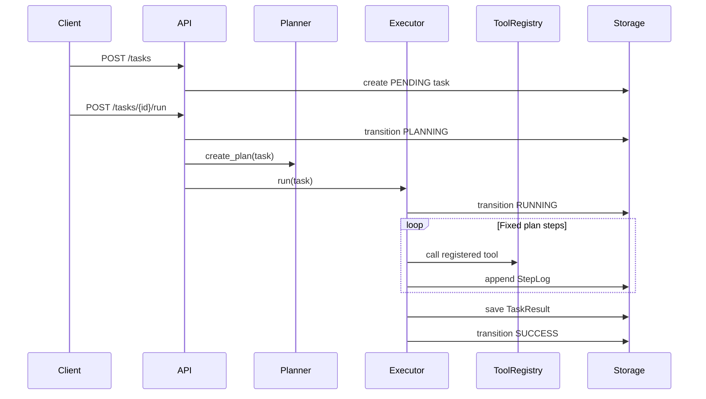
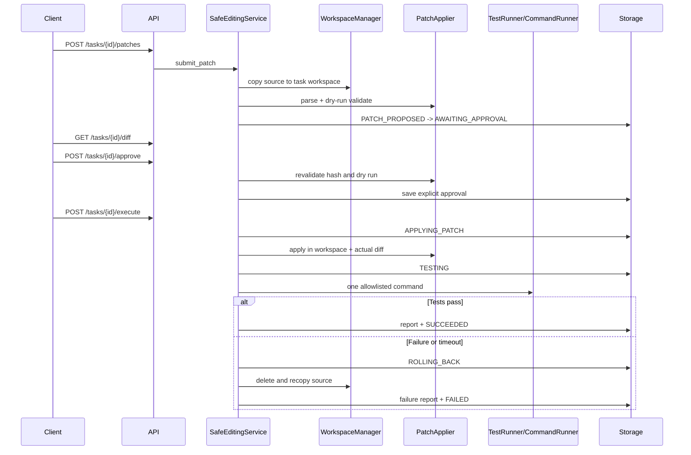

# OpenCode-Lite Architecture

## Design Goal

OpenCode-Lite keeps the v0.2 Planner, Executor, ToolRegistry, and JSON Storage design,
then adds a separate safe-editing path. Repository understanding remains read-only;
patch application is possible only after workspace isolation and explicit approval.

The internal package is still named `repopilot_lite` for import compatibility.

## Components

| Module | Responsibility |
| --- | --- |
| `main.py` | FastAPI application, dependencies, route validation, HTTP error mapping |
| `models.py` | Pydantic API, task, patch, command, log, and execution-report contracts |
| `planner.py` | Fixed and bounded repository-analysis plan |
| `executor.py` | Sequential tool execution and two-retry keyword-search loop |
| `tools.py` | ToolRegistry, repository readers, search, and summarization |
| `llm_client.py` | Optional OpenAI-compatible summarizer; returns `None` on failure |
| `state_machine.py` | Single declaration of legal task status transitions |
| `workspace.py` | Source validation, isolated copy, reset, cleanup, and hash comparison |
| `patching.py` | Unified-diff parsing, containment checks, dry run, apply, actual diff |
| `runners.py` | argv-based CommandRunner and allowlisted TestRunner |
| `editing_service.py` | Patch lifecycle, approval gate, execution, report, and rollback |
| `storage.py` | JSON persistence and observable state-transition logs |

## Analysis Data Flow

The Executor owns the existing bounded Agent Loop. `search_text` runs once and retries
at most twice with broader keywords only when no matches are found.

## Safe Editing Data Flow

## State Ownership

Business modules do not assign `task.status` directly. `Storage.transition_status`
calls the state machine, persists the task, and appends a transition log. Approval does
not advance the task out of `AWAITING_APPROVAL`; it updates the immutable patch record.
Only `/execute` can move an approved task to `APPLYING_PATCH`.

`SUCCESS` is retained for the v0.2-compatible analysis endpoint. `SUCCEEDED` is the
successful terminal state for the safe-editing workflow.

## Persistence

Three JSON objects are stored under `data/`:

- `tasks.json`: task records, analysis results, workspace references, and reports.
- `logs.json`: ordered `StepLog` arrays keyed by task ID.
- `patches.json`: immutable patch text plus validation and approval metadata.

Writes use a temporary sibling file followed by `Path.replace`. An in-process `RLock`
prevents concurrent threads from interleaving writes. This is intentionally not a
multi-process transaction model.

## Core Invariants

1. `repo_path` is never a patch or command cwd.
2. Every editable file resolves below the task workspace.
3. Every executed patch has a current approval matching its ID and content hash.
4. Every command uses argv, `shell=False`, a timeout, and workspace-contained cwd.
5. Every execution attempt yields either a success report or a partial failure report.
6. Every post-apply failure attempts rollback before the task reaches `FAILED`.
7. Search, patch, and test behavior have explicit execution bounds.
