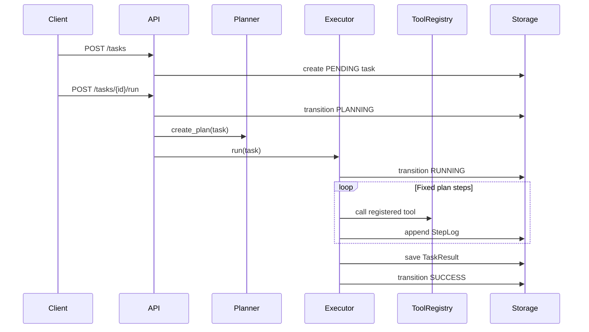
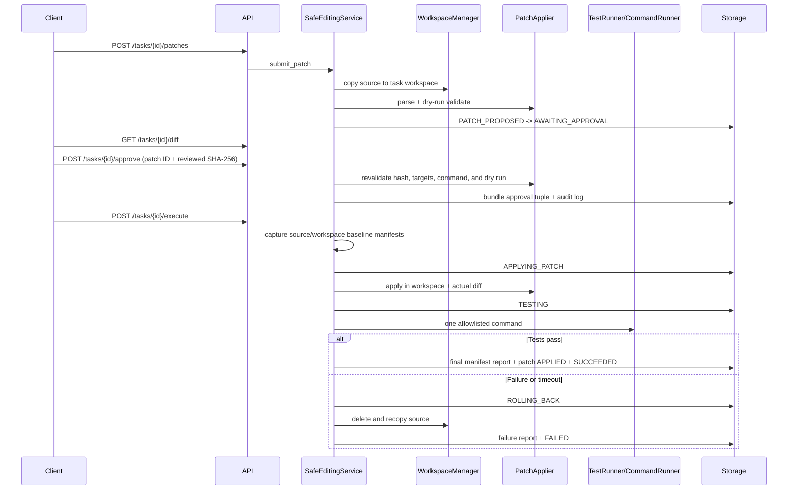

# OpenCode-Lite Architecture

## Design Goal

OpenCode-Lite keeps the v0.2 Planner, Executor, ToolRegistry, and JSON Storage design,
then adds a separate safe-editing path. Repository understanding remains read-only;
patch application is possible only after workspace isolation and explicit approval.

The internal package is still named `repopilot_lite` for import compatibility.

## Components

| Module | Responsibility |
| --- | --- |
| `main.py` | FastAPI application, dependencies, route validation, HTTP error mapping |
| `models.py` | Pydantic API, task, patch, command, log, and execution-report contracts |
| `planner.py` | Fixed and bounded repository-analysis plan |
| `executor.py` | Sequential tool execution and two-retry keyword-search loop |
| `tools.py` | ToolRegistry, repository readers, search, and summarization |
| `llm_client.py` | Optional OpenAI-compatible summarizer; returns `None` on failure |
| `state_machine.py` | Single declaration of legal task status transitions |
| `workspace.py` | Source validation, isolated copy, reset, cleanup, and hash comparison |
| `filesystem_safety.py` | No-follow traversal, reparse detection, identity checks, manifests |
| `patching.py` | Unified-diff parsing, containment checks, dry run, apply, actual diff |
| `runners.py` | argv-based CommandRunner and allowlisted TestRunner |
| `editing_service.py` | Patch lifecycle, approval gate, execution, report, and rollback |
| `task_locks.py` | Bounded per-task serialization within one application process |
| `storage.py` | Revisioned JSON persistence, redo journal, and transition logs |

## Analysis Data Flow

The Executor owns the existing bounded Agent Loop. `search_text` runs once and retries
at most twice with broader keywords only when no matches are found.

## Safe Editing Data Flow

## State Ownership

Business modules do not persist `task.status` directly. `Storage.transition_status`
calls the state machine and bundles the task revision with its transition log; ordinary
update methods reject status changes. Candidate models are synchronized back to callers
only after the write succeeds. Approval does not advance the task out of
`AWAITING_APPROVAL`; it bundles task, immutable patch metadata, and its audit log. Only
`/execute` can move an approved task to `APPLYING_PATCH`.

`SUCCESS` is retained for the v0.2-compatible analysis endpoint. `SUCCEEDED` is the
successful terminal state for the safe-editing workflow.

## Persistence

Three JSON objects are stored under `data/`:

- `tasks.json`: task records, analysis results, workspace references, and reports.
- `logs.json`: ordered `StepLog` arrays keyed by task ID.
- `patches.json`: immutable patch text plus validation and approval metadata.

Each single-file write uses a unique sibling temporary file, flush, best-effort fsync,
and `os.replace`. A task/patch/log bundle first writes `transaction.json` as a redo
journal, replaces every target, then removes the journal. Initialization and every
public read complete an interrupted journal before returning data.

An in-process storage `RLock`, per-task workflow locks, and monotonic task revisions
prevent thread interleaving and stale overwrites. This is intentionally not a
multi-process transaction or lease model; v0.3 must run with one Uvicorn worker.

## Core Invariants

1. Harness-managed writes never use `repo_path` as a patch, reset, cleanup, or cwd
   target; trusted test code is explicitly outside this OS-level guarantee.
2. Every editable file is no-follow validated below the task workspace, and all
   symlink/junction/reparse entries are rejected.
3. Every executed patch has a current approval matching patch ID, content SHA-256,
   normalized command hash, and task revision.
4. Every command uses argv, `shell=False`, a timeout, workspace-contained cwd, bounded
   streaming output, and a POSIX process group or Windows Job Object.
5. `SUCCEEDED` requires safe removal of ignored cache/build artifacts, then a full
   post-test workspace manifest equal to the approved post-patch manifest; source
   before/after comparison uses the documented copy policy.
6. `rollback_succeeded=true` requires the restored manifest to equal the execution
   baseline, the source to remain unchanged, and process cleanup evidence not to fail.
7. Task/patch/report/status/log bundles are redo-journal recoverable; whole-process
   recovery of an in-flight command remains a documented v0.3 limitation.
8. Search, patch, command, and test behavior have explicit execution bounds.
